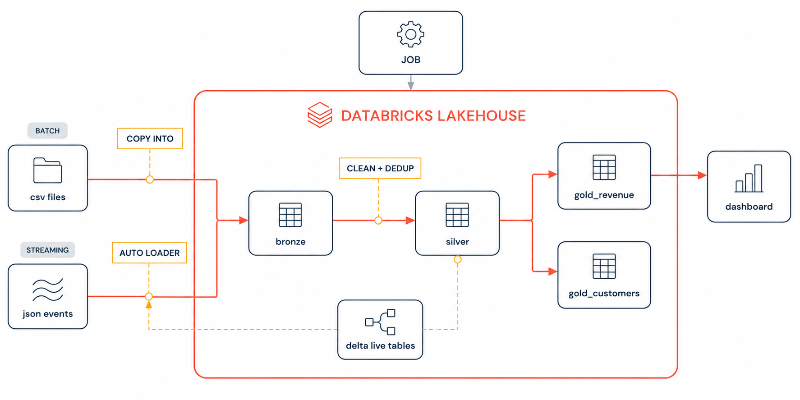

# ShopStream
End-to-End Databricks Lakehouse Project (Batch + Streaming)

Build a batch + streaming medallion architecture on Databricks Free Edition:
COPY INTO batch ingestion, Auto Loader streaming, Delta Lake time travel,
Lakeflow (Delta Live Tables) pipelines, a scheduled job, and a live sales dashboard.

## Files

- `generate_seed_data.py` — run locally with `python3 generate_seed_data.py` (no installs
  needed). Generates the three seeded CSVs you upload in lesson 1: 1,000 customers,
  197 products, and 13,717 order lines with realistic data-quality problems planted
  on purpose (duplicates, bad quantities, inconsistent status casing).
- `stream_events_notebook.py` — import into your Databricks workspace
  (Workspace → Import) as the `04_stream_events` notebook. Run it in lesson 5 to
  simulate the live order feed: 60 JSON files, 25 events each, one every 5 seconds.

## 🏗️ Project Architecture

The project follows a **Databricks Lakehouse Medallion Architecture** and supports
both batch and streaming data ingestion.

### Data Flow

- **Batch:** CSV files → `COPY INTO` → Bronze
- **Streaming:** JSON events → Auto Loader → Bronze
- **Bronze:** Raw ingested data
- **Silver:** Cleaned and deduplicated data
- **Gold:** Business-ready datasets for analytics
- **Delta Live Tables / Lakeflow:** Data transformation pipelines
- **Databricks Job:** Schedules and orchestrates the pipeline
- **Dashboard:** Displays sales and customer insights

### Architecture Diagram

  

